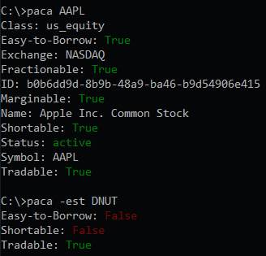

# paca
Check asset status using [Alpaca Broker API](https://alpaca.markets/)



## Requirements
- [Python 3](https://www.python.org/downloads/)
- [alpaca_trade_api](https://github.com/alpacahq/alpaca-trade-api-python)
- [colorama](https://github.com/tartley/colorama)

## Setup
1. Install paca using pip:
```
    pip install paca
```
2. Create API keys using the [Alpaca dashboard](https://app.alpaca.markets/login). Refer to Alpaca's [API v2](https://alpaca.markets/docs/api-documentation/api-v2/) and [API Documentation](https://alpaca.markets/docs/api-documentation/) for more details.
3. Set environment variables APCA_API_KEY_ID and APCA_API_SECRET_KEY.
paca can be used with Alpaca paper accounts by setting APCA_API_BASE_URL=https://paper-api.alpaca.markets. Refer to
[Alpaca Environment Variables](https://github.com/alpacahq/alpaca-trade-api-python#alpaca-environment-variables).

## Usage
```
usage: paca [-h] [-a] [-e] [-ex] [-f] [-i] [-m] [-n] [-s] [-st] [-sy] [-t] [-v] ASSET

Check asset status using Alpaca Broker API

positional arguments:
  ASSET                 Ticker of asset to check

optional arguments:
  -h, --help            show this help message and exit
  -a, --asset-class     Class of asset: us_equity or crypto
  -e, --easy-to-borrow  Easy-to-Borrow or Hard-to-Borrow status
  -ex, --exchange       Exchange asset is available on
  -f, --fractionable    Fractionable status
  -i, --id              ID of asset
  -m, --marginable      Marginable status
  -n, --name            Full name of asset
  -s, --shortable       Shortable status
  -st, --status         Status of asset: active or inactive
  -sy, --symbol         Symbol/ticker
  -t, --tradable        Tradable status
  -v, --version         show program's version number and exit

Examples

> paca AAPL
Class: us_equity
Easy-to-Borrow: True
Exchange: NASDAQ
Fractionable: True
ID: b0b6dd9d-8b9b-48a9-ba46-b9d54906e415
Marginable: True
Name: Apple Inc. Common Stock
Shortable: True
Status: active
Symbol: AAPL
Tradable: True

> paca -est DNUT
Easy-to-Borrow: False
Shortable: False
Tradable: True
```

## Related
[shortable](https://github.com/rgomezjnr/shortable) - Receive an alert if an asset becomes shortable, e.g. from HTB to ETB, or vice versa

## Support
If you find an issue or have any feedback please submit an issue on [GitHub](https://github.com/rgomezjnr/paca/issues).

If you would like to show your support donations are greatly appeciated via:
- [GitHub Sponsors](https://github.com/sponsors/rgomezjnr)
- [PayPal](https://paypal.me/rgomezjnr)
- [Venmo](https://account.venmo.com/u/rgomezjnr)
- [Cash app](https://cash.app/$rgomezjnr)
- [Strike](https://strike.me/rgomezjnr)
- [PayNym:](https://paynym.is/+orangesmoke693) +orangesmoke693
- [Bitcoin:](bitcoin:bc1qh46qmztl77d9dl8f6ezswvqdqxcaurrqegca2p) bc1qh46qmztl77d9dl8f6ezswvqdqxcaurrqegca2p
- [Ethereum:](ethereum:0xAB443e578c9eA629088e26A9009e44Ed40f68678) 0xAB443e578c9eA629088e26A9009e44Ed40f68678

## Author
[Robert Gomez, Jr.](https://github.com/rgomezjnr)

## Source code
https://github.com/rgomezjnr/paca

## License
[MIT](https://github.com/rgomezjnr/paca/blob/master/LICENSE.txt)
